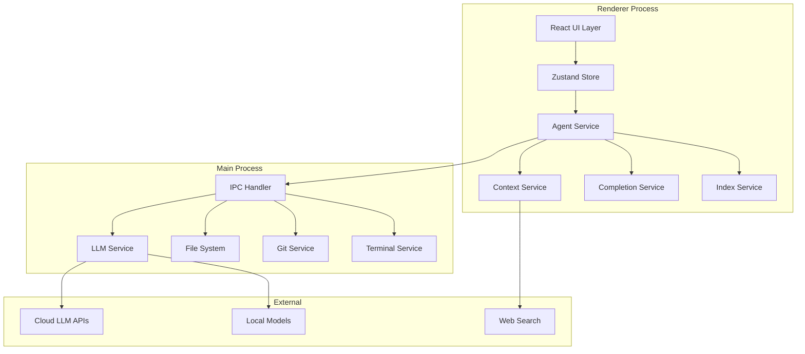
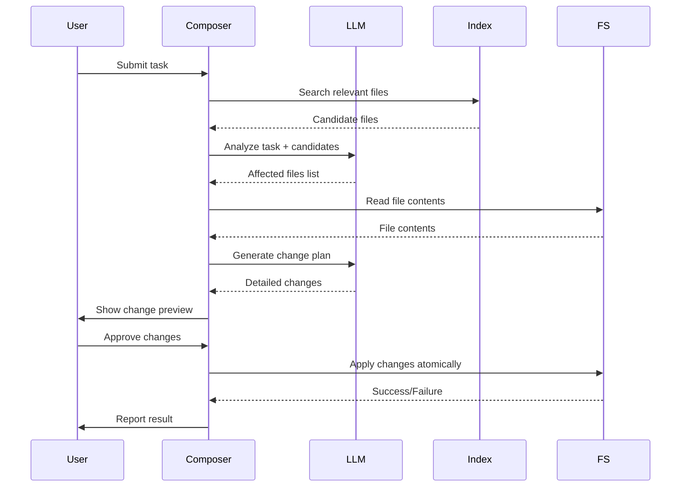

# Design Document: Adnify Enhancement

## Core Development Principles (不可变规则)

**所有代码实现必须严格遵守以下原则：**

```typescript
// ❌ 错误示例
const data: any = fetchData()  // 禁止 any
useEffect(() => {
  const timer = setInterval(() => {}, 1000)
  // 缺少清理函数 - 内存泄漏！
}, [])

// ✅ 正确示例
interface Data { id: string; name: string }
const data: Data = fetchData()

useEffect(() => {
  const timer = setInterval(() => {}, 1000)
  return () => clearInterval(timer)  // 必须清理
}, [])
```

### 代码质量检查清单
- [ ] 函数不超过 50 行
- [ ] 文件不超过 300 行
- [ ] 无 any 类型（或有明确注释）
- [ ] 所有 useEffect 有清理函数（如需要）
- [ ] 使用 React.memo 优化纯组件
- [ ] 异步操作有错误处理
- [ ] 命名清晰有意义

## Overview

本设计文档描述了 Adnify AI 代码编辑器的增强架构，目标是构建一个功能超越 Cursor 的现代化 AI 编程助手。设计遵循模块化、可扩展的原则，确保各功能组件可以独立开发和测试。

## Architecture



### 分层架构

1. **UI Layer**: React 组件，负责用户交互和视图渲染
2. **State Layer**: Zustand store，管理全局状态
3. **Service Layer**: 业务逻辑服务（Agent、Context、Completion、Index）
4. **IPC Layer**: Electron IPC 通信
5. **Backend Layer**: Main process 服务（LLM、FS、Git、Terminal）

## Components and Interfaces

### 1. Completion Service (代码补全)

```typescript
// src/renderer/services/completionService.ts
interface CompletionService {
  // 获取补全建议
  getCompletion(context: CompletionContext): Promise<CompletionResult>
  // 取消当前请求
  cancel(): void
  // 接受建议
  accept(suggestion: string): void
  // 配置
  configure(options: CompletionOptions): void
}

interface CompletionContext {
  filePath: string
  fileContent: string
  cursorPosition: { line: number; column: number }
  prefix: string  // 光标前的文本
  suffix: string  // 光标后的文本
  language: string
  openFiles: { path: string; content: string }[]
}

interface CompletionResult {
  suggestions: CompletionSuggestion[]
  cached: boolean
}

interface CompletionSuggestion {
  text: string
  displayText: string
  range: { start: number; end: number }
  confidence: number
}

interface CompletionOptions {
  enabled: boolean
  debounceMs: number
  maxTokens: number
  temperature: number
}
```

### 2. Inline Edit Service (内联编辑)

```typescript
// src/renderer/services/inlineEditService.ts
interface InlineEditService {
  // 开始内联编辑
  start(context: InlineEditContext): void
  // 提交指令
  submit(instruction: string): Promise<InlineEditResult>
  // 接受更改
  accept(): void
  // 拒绝更改
  reject(): void
  // 取消
  cancel(): void
}

interface InlineEditContext {
  filePath: string
  selection: { start: Position; end: Position }
  selectedText: string
  fullContent: string
}

interface InlineEditResult {
  original: string
  modified: string
  diff: DiffHunk[]
}

interface DiffHunk {
  type: 'add' | 'remove' | 'unchanged'
  content: string
  lineNumber: number
}
```

### 3. Composer Service (多文件编辑)

```typescript
// src/renderer/services/composerService.ts
interface ComposerService {
  // 分析任务，确定受影响的文件
  analyzeTask(task: string): Promise<AffectedFiles>
  // 生成更改计划
  generatePlan(task: string, files: string[]): Promise<ChangePlan>
  // 执行更改
  applyChanges(plan: ChangePlan): Promise<ApplyResult>
  // 回滚更改
  rollback(checkpointId: string): Promise<void>
}

interface AffectedFiles {
  files: { path: string; reason: string }[]
  confidence: number
}

interface ChangePlan {
  id: string
  description: string
  changes: FileChange[]
  checkpoint: Checkpoint
}

interface FileChange {
  path: string
  type: 'create' | 'modify' | 'delete'
  original?: string
  modified?: string
  diff?: DiffHunk[]
}

interface ApplyResult {
  success: boolean
  appliedFiles: string[]
  failedFiles: { path: string; error: string }[]
}
```

### 4. Index Service (代码库索引)

```typescript
// src/renderer/services/indexService.ts
interface IndexService {
  // 开始索引
  startIndexing(workspacePath: string): Promise<void>
  // 搜索
  search(query: string, options?: SearchOptions): Promise<SearchResult[]>
  // 获取索引状态
  getStatus(): IndexStatus
  // 更新单个文件
  updateFile(filePath: string): Promise<void>
  // 删除文件索引
  removeFile(filePath: string): Promise<void>
}

interface IndexStatus {
  state: 'idle' | 'indexing' | 'ready' | 'error'
  progress: number
  totalFiles: number
  indexedFiles: number
  lastUpdated: Date
}

interface SearchResult {
  filePath: string
  content: string
  score: number
  lineStart: number
  lineEnd: number
  highlights: { start: number; end: number }[]
}

interface SearchOptions {
  maxResults: number
  fileTypes?: string[]
  excludePaths?: string[]
}
```

### 5. Enhanced Context Service (增强上下文)

```typescript
// src/renderer/agent/contextService.ts (扩展现有)
interface ContextService {
  // 解析 @ 引用
  parseReferences(input: string): ContextReference[]
  // 收集上下文
  collectContext(refs: ContextReference[]): Promise<CollectedContext>
  // 搜索符号
  searchSymbols(query: string): Promise<Symbol[]>
  // 搜索网页
  searchWeb(query: string): Promise<WebResult[]>
  // 搜索文档
  searchDocs(query: string, dependencies: string[]): Promise<DocResult[]>
}

type ContextReference = 
  | { type: 'file'; path: string }
  | { type: 'folder'; path: string }
  | { type: 'symbol'; name: string }
  | { type: 'web'; query: string }
  | { type: 'docs'; query: string }
  | { type: 'terminal' }
  | { type: 'git' }
  | { type: 'codebase'; query: string }

interface Symbol {
  name: string
  kind: 'function' | 'class' | 'variable' | 'interface' | 'type'
  filePath: string
  line: number
  signature?: string
}
```

### 6. Checkpoint Service (检查点)

```typescript
// src/renderer/agent/checkpointService.ts (扩展现有)
interface CheckpointService {
  // 创建检查点
  create(description: string, files: string[]): Promise<Checkpoint>
  // 恢复到检查点
  restore(checkpointId: string): Promise<void>
  // 获取检查点列表
  list(): Checkpoint[]
  // 获取检查点详情
  getDetails(checkpointId: string): Promise<CheckpointDetails>
  // 持久化检查点
  persist(): Promise<void>
  // 加载检查点
  load(workspacePath: string): Promise<void>
}

interface Checkpoint {
  id: string
  description: string
  timestamp: Date
  files: string[]
}

interface CheckpointDetails {
  checkpoint: Checkpoint
  fileSnapshots: { path: string; content: string }[]
  diff: FileChange[]
}
```

### 7. Local Model Service (本地模型)

```typescript
// src/main/llm/providers/local.ts
interface LocalModelService {
  // 检测可用模型
  detectModels(): Promise<LocalModel[]>
  // 连接到模型
  connect(model: LocalModel): Promise<boolean>
  // 发送消息
  sendMessage(params: LLMParams): AsyncGenerator<string>
  // 检查健康状态
  healthCheck(): Promise<boolean>
}

interface LocalModel {
  name: string
  provider: 'ollama' | 'lmstudio'
  endpoint: string
  capabilities: ('chat' | 'completion' | 'vision')[]
}
```

## Data Models

### Store Extensions

```typescript
// 扩展现有 store
interface EnhancedEditorState extends EditorState {
  // 代码补全
  completionEnabled: boolean
  currentCompletion: CompletionSuggestion | null
  
  // 内联编辑
  inlineEditState: {
    active: boolean
    position: Position | null
    result: InlineEditResult | null
  }
  
  // Composer
  composerState: {
    active: boolean
    plan: ChangePlan | null
    applying: boolean
  }
  
  // 索引
  indexStatus: IndexStatus
  
  // 本地模型
  localModels: LocalModel[]
  
  // 项目规则
  projectRules: string | null
}
```

### Persistence Models

```typescript
// 检查点持久化
interface PersistedCheckpoint {
  id: string
  workspacePath: string
  description: string
  timestamp: number
  files: {
    path: string
    content: string
    hash: string
  }[]
}

// 会话持久化
interface PersistedSession {
  id: string
  workspacePath: string
  messages: Message[]
  context: ContextReference[]
  createdAt: number
  updatedAt: number
}

// 索引持久化
interface PersistedIndex {
  workspacePath: string
  version: number
  files: {
    path: string
    hash: string
    chunks: {
      content: string
      embedding?: number[]
      startLine: number
      endLine: number
    }[]
  }[]
  lastUpdated: number
}
```


## Correctness Properties

*A property is a characteristic or behavior that should hold true across all valid executions of a system-essentially, a formal statement about what the system should do. Properties serve as the bridge between human-readable specifications and machine-verifiable correctness guarantees.*

Based on the prework analysis, the following correctness properties have been identified:

### Code Completion Properties

**Property 1: Tab acceptance inserts suggestion**
*For any* active completion suggestion, pressing Tab SHALL result in the document content containing the suggestion text at the cursor position.
**Validates: Requirements 1.2**

**Property 2: Escape dismisses suggestion**
*For any* active completion suggestion, pressing Escape SHALL result in the suggestion being null/hidden.
**Validates: Requirements 1.3**

**Property 3: Context includes required fields**
*For any* completion request, the context object SHALL contain filePath, fileContent, cursorPosition, and openFiles.
**Validates: Requirements 1.5**

### Inline Edit Properties

**Property 4: Cmd+K activates inline edit**
*For any* editor state, pressing Cmd+K (or Ctrl+K) SHALL result in inlineEditState.active being true.
**Validates: Requirements 2.1**

**Property 5: Selection included in context**
*For any* text selection followed by Cmd+K, the inline edit context SHALL contain the selected text.
**Validates: Requirements 2.2**

**Property 6: Accept applies changes**
*For any* inline edit result, accepting SHALL result in document content matching the modified version.
**Validates: Requirements 2.5**

**Property 7: Reject restores original**
*For any* inline edit result, rejecting SHALL result in document content matching the original version.
**Validates: Requirements 2.6**

### Composer Properties

**Property 8: Atomic apply all**
*For any* change plan with multiple files, "Apply All" SHALL either modify all files or none (on failure).
**Validates: Requirements 3.4, 3.7**

**Property 9: Checkpoint before modification**
*For any* file modification via composer, a checkpoint SHALL be created before the modification.
**Validates: Requirements 3.6**

### Index Properties

**Property 10: Search result limit**
*For any* codebase search query, the results SHALL contain at most 10 items sorted by relevance score descending.
**Validates: Requirements 4.4**

**Property 11: Incremental update**
*For any* file modification in an indexed workspace, only the modified file SHALL be re-indexed.
**Validates: Requirements 4.5**

### Context Properties

**Property 12: @folder expansion**
*For any* @folder reference, the collected context SHALL include all files within that folder.
**Validates: Requirements 5.3**

**Property 13: Context pills display**
*For any* added context reference, a corresponding context pill SHALL be visible in the UI.
**Validates: Requirements 5.7**

### Checkpoint Properties

**Property 14: Checkpoint creation on modification**
*For any* AI-initiated file modification, a checkpoint with timestamp and description SHALL be created.
**Validates: Requirements 7.1**

**Property 15: Restore matches checkpoint**
*For any* checkpoint restore operation, all affected files SHALL have content matching the checkpoint snapshot.
**Validates: Requirements 7.4**

**Property 16: Restore preserves future checkpoints**
*For any* checkpoint restore operation, checkpoints created after the restore point SHALL remain in the list.
**Validates: Requirements 7.5**

### Local Model Properties

**Property 17: Model detection**
*For any* Ollama configuration, the system SHALL detect and list available models from localhost.
**Validates: Requirements 8.2**

**Property 18: Conversation preservation on model switch**
*For any* model switch operation, the message history SHALL remain unchanged.
**Validates: Requirements 8.5**

### Rules Properties

**Property 19: Rules inclusion in prompts**
*For any* AI request when .adnify/rules.md exists, the prompt SHALL include the rules file content.
**Validates: Requirements 9.1**

**Property 20: Rules hot reload**
*For any* modification to .adnify/rules.md, the rules SHALL be reloaded without application restart.
**Validates: Requirements 9.4**

### Image Properties

**Property 21: Vision model requirement**
*For any* conversation containing images, the system SHALL use a vision-capable model or display a warning.
**Validates: Requirements 10.4, 10.5**

### Git Properties

**Property 22: @git context inclusion**
*For any* @git reference in chat, the context SHALL include current Git status and recent commits.
**Validates: Requirements 11.4**

### Error Diagnosis Properties

**Property 23: Fix proposal includes diff**
*For any* AI-proposed fix, the proposal SHALL include a diff preview showing changes.
**Validates: Requirements 15.4**

**Property 24: Multiple fixes ranked**
*For any* error with multiple possible fixes, the fixes SHALL be presented in order of confidence score.
**Validates: Requirements 15.5**

## Error Handling

### LLM Errors
- **Connection Timeout**: Retry up to 3 times with exponential backoff
- **Rate Limiting**: Queue requests and display user notification
- **Invalid Response**: Log error, notify user, allow retry
- **Model Unavailable**: Suggest alternative models

### File System Errors
- **Permission Denied**: Display clear error with suggested actions
- **File Not Found**: Remove from open files, notify user
- **Disk Full**: Warn user before operations that require disk space

### Index Errors
- **Corrupted Index**: Rebuild from scratch with user confirmation
- **Memory Overflow**: Process in smaller batches

### Checkpoint Errors
- **Restore Failure**: Partial restore with detailed error report
- **Persistence Failure**: Retry with user notification

## Testing Strategy

### Unit Testing
- Use Vitest for unit tests
- Test each service in isolation with mocked dependencies
- Focus on edge cases and error conditions

### Property-Based Testing
- Use fast-check for property-based tests
- Configure minimum 100 iterations per property
- Test core logic across many inputs

### Integration Testing
- Test IPC communication between renderer and main process
- Test LLM provider integrations with mock servers
- Test file system operations with temporary directories

### E2E Testing
- Use Playwright for end-to-end tests
- Test critical user flows (completion, inline edit, composer)
- Test keyboard shortcuts and UI interactions

### Test File Organization
```
src/
├── renderer/
│   ├── services/
│   │   ├── completionService.ts
│   │   ├── completionService.test.ts
│   │   ├── completionService.property.test.ts
│   │   └── ...
│   └── agent/
│       ├── contextService.ts
│       ├── contextService.test.ts
│       └── ...
└── main/
    ├── llm/
    │   ├── llmService.ts
    │   ├── llmService.test.ts
    │   └── ...
    └── ...
```


## Detailed Component Design

### 1. Code Completion - 详细设计

#### 触发机制
```typescript
// 补全触发条件
interface CompletionTrigger {
  // 自动触发：用户停止输入后
  autoTriggerDelay: 150  // ms
  // 手动触发：Ctrl+Space
  manualTrigger: 'ctrl+space'
  // 触发字符：特定字符后自动触发
  triggerCharacters: ['.', '(', '{', '[', '"', "'", '/', '@', '#']
}
```

#### 上下文收集策略
```typescript
// 智能上下文收集
function collectCompletionContext(editor: Monaco.Editor): CompletionContext {
  const model = editor.getModel()
  const position = editor.getPosition()
  
  // 1. 当前文件上下文
  const currentFile = {
    path: model.uri.path,
    content: model.getValue(),
    language: model.getLanguageId()
  }
  
  // 2. 光标前后文本（FIM - Fill in the Middle）
  const prefix = model.getValueInRange({
    startLineNumber: Math.max(1, position.lineNumber - 50),
    startColumn: 1,
    endLineNumber: position.lineNumber,
    endColumn: position.column
  })
  
  const suffix = model.getValueInRange({
    startLineNumber: position.lineNumber,
    startColumn: position.column,
    endLineNumber: Math.min(model.getLineCount(), position.lineNumber + 20),
    endColumn: model.getLineMaxColumn(Math.min(model.getLineCount(), position.lineNumber + 20))
  })
  
  // 3. 相关文件上下文（基于 import/require）
  const relatedFiles = analyzeImports(currentFile.content)
  
  // 4. 最近编辑的文件
  const recentFiles = getRecentlyEditedFiles(5)
  
  return { currentFile, prefix, suffix, relatedFiles, recentFiles }
}
```

#### Ghost Text 渲染
```typescript
// Monaco Editor Ghost Text 实现
class GhostTextWidget implements Monaco.IContentWidget {
  private domNode: HTMLElement
  private suggestion: string = ''
  
  constructor(private editor: Monaco.Editor) {
    this.domNode = document.createElement('div')
    this.domNode.className = 'ghost-text-widget'
    this.domNode.style.cssText = `
      color: rgba(255, 255, 255, 0.4);
      font-style: italic;
      pointer-events: none;
    `
  }
  
  show(suggestion: string, position: Monaco.Position) {
    this.suggestion = suggestion
    this.domNode.textContent = suggestion
    this.editor.addContentWidget(this)
  }
  
  hide() {
    this.editor.removeContentWidget(this)
  }
  
  accept() {
    const position = this.editor.getPosition()
    this.editor.executeEdits('ghost-text', [{
      range: new Monaco.Range(
        position.lineNumber, position.column,
        position.lineNumber, position.column
      ),
      text: this.suggestion
    }])
    this.hide()
  }
}
```

### 2. Inline Edit (Cmd+K) - 详细设计

#### UI 组件结构
```
┌─────────────────────────────────────────────────────────┐
│  Selected Code (highlighted)                            │
├─────────────────────────────────────────────────────────┤
│  ┌─────────────────────────────────────────────────┐   │
│  │ 🔮 Describe your changes...                     │   │
│  │ ________________________________________________│   │
│  │ [Generate] [Cancel]                             │   │
│  └─────────────────────────────────────────────────┘   │
├─────────────────────────────────────────────────────────┤
│  Diff Preview (after generation):                       │
│  - function oldCode() { ... }                          │
│  + function newCode() { ... }                          │
│  [Accept] [Reject] [Edit]                              │
└─────────────────────────────────────────────────────────┘
```

#### 状态机
```typescript
type InlineEditState = 
  | { phase: 'idle' }
  | { phase: 'input'; position: Position; selection?: Selection }
  | { phase: 'generating'; instruction: string }
  | { phase: 'preview'; result: InlineEditResult }
  | { phase: 'applying' }

// 状态转换
const transitions = {
  'idle -> input': 'Cmd+K pressed',
  'input -> generating': 'Enter pressed with instruction',
  'input -> idle': 'Escape pressed',
  'generating -> preview': 'Generation complete',
  'generating -> idle': 'Generation cancelled/failed',
  'preview -> applying': 'Accept clicked',
  'preview -> idle': 'Reject clicked',
  'applying -> idle': 'Apply complete'
}
```

#### Diff 算法
```typescript
// 使用 Myers diff 算法生成行级别差异
import { diffLines } from 'diff'

function generateDiff(original: string, modified: string): DiffHunk[] {
  const changes = diffLines(original, modified)
  const hunks: DiffHunk[] = []
  let lineNumber = 1
  
  for (const change of changes) {
    const lines = change.value.split('\n').filter(l => l !== '')
    
    for (const line of lines) {
      hunks.push({
        type: change.added ? 'add' : change.removed ? 'remove' : 'unchanged',
        content: line,
        lineNumber: change.removed ? lineNumber : lineNumber++
      })
      if (!change.removed) lineNumber++
    }
  }
  
  return hunks
}
```

### 3. Composer Mode - 详细设计

#### 任务分析流程


#### 原子性保证
```typescript
async function applyChangesAtomically(plan: ChangePlan): Promise<ApplyResult> {
  // 1. 创建检查点
  const checkpoint = await checkpointService.create(
    `Composer: ${plan.description}`,
    plan.changes.map(c => c.path)
  )
  
  // 2. 验证所有文件可写
  for (const change of plan.changes) {
    if (!await canWrite(change.path)) {
      return { success: false, error: `Cannot write to ${change.path}` }
    }
  }
  
  // 3. 应用所有更改
  const applied: string[] = []
  try {
    for (const change of plan.changes) {
      await applyFileChange(change)
      applied.push(change.path)
    }
    return { success: true, appliedFiles: applied, failedFiles: [] }
  } catch (error) {
    // 4. 失败时回滚
    await checkpointService.restore(checkpoint.id)
    return { 
      success: false, 
      appliedFiles: [], 
      failedFiles: [{ path: applied[applied.length - 1], error: error.message }]
    }
  }
}
```

### 4. Codebase Index - 详细设计

#### 索引结构
```typescript
// 使用 TF-IDF + 代码结构的混合索引
interface CodeIndex {
  // 文件级索引
  files: Map<string, FileIndex>
  // 符号索引
  symbols: Map<string, SymbolEntry[]>
  // 倒排索引（词 -> 文件位置）
  invertedIndex: Map<string, DocumentPosting[]>
}

interface FileIndex {
  path: string
  hash: string  // 用于增量更新检测
  language: string
  chunks: CodeChunk[]
  symbols: string[]
  imports: string[]
  exports: string[]
}

interface CodeChunk {
  content: string
  startLine: number
  endLine: number
  type: 'function' | 'class' | 'block' | 'comment'
  tfidf: Map<string, number>  // 词频-逆文档频率
}
```

#### 增量更新策略
```typescript
async function updateIndex(changedFiles: string[]): Promise<void> {
  for (const filePath of changedFiles) {
    const currentHash = await computeFileHash(filePath)
    const existingIndex = index.files.get(filePath)
    
    if (existingIndex?.hash === currentHash) {
      continue  // 文件未变化，跳过
    }
    
    // 移除旧索引
    if (existingIndex) {
      removeFromInvertedIndex(existingIndex)
      removeSymbols(existingIndex)
    }
    
    // 创建新索引
    const newIndex = await indexFile(filePath)
    index.files.set(filePath, newIndex)
    addToInvertedIndex(newIndex)
    addSymbols(newIndex)
  }
  
  // 持久化
  await persistIndex()
}
```

#### 语义搜索
```typescript
async function semanticSearch(query: string, options: SearchOptions): Promise<SearchResult[]> {
  // 1. 分词
  const queryTokens = tokenize(query)
  
  // 2. 计算查询向量
  const queryVector = computeTFIDF(queryTokens)
  
  // 3. 候选检索（倒排索引）
  const candidates = new Set<string>()
  for (const token of queryTokens) {
    const postings = index.invertedIndex.get(token) || []
    for (const posting of postings) {
      candidates.add(posting.filePath)
    }
  }
  
  // 4. 相似度计算
  const results: SearchResult[] = []
  for (const filePath of candidates) {
    const fileIndex = index.files.get(filePath)
    for (const chunk of fileIndex.chunks) {
      const score = cosineSimilarity(queryVector, chunk.tfidf)
      if (score > 0.1) {
        results.push({
          filePath,
          content: chunk.content,
          score,
          lineStart: chunk.startLine,
          lineEnd: chunk.endLine
        })
      }
    }
  }
  
  // 5. 排序并返回 top K
  return results
    .sort((a, b) => b.score - a.score)
    .slice(0, options.maxResults || 10)
}
```

### 5. Local Model Integration - 详细设计

#### Ollama 集成
```typescript
// src/main/llm/providers/ollama.ts
class OllamaProvider implements LLMProvider {
  private baseUrl = 'http://localhost:11434'
  
  async detectModels(): Promise<LocalModel[]> {
    try {
      const response = await fetch(`${this.baseUrl}/api/tags`)
      const data = await response.json()
      
      return data.models.map(m => ({
        name: m.name,
        provider: 'ollama',
        endpoint: this.baseUrl,
        capabilities: this.inferCapabilities(m.name)
      }))
    } catch (error) {
      console.error('Ollama not available:', error)
      return []
    }
  }
  
  async *sendMessage(params: LLMParams): AsyncGenerator<string> {
    const response = await fetch(`${this.baseUrl}/api/chat`, {
      method: 'POST',
      headers: { 'Content-Type': 'application/json' },
      body: JSON.stringify({
        model: params.model,
        messages: params.messages,
        stream: true
      })
    })
    
    const reader = response.body.getReader()
    const decoder = new TextDecoder()
    
    while (true) {
      const { done, value } = await reader.read()
      if (done) break
      
      const chunk = decoder.decode(value)
      const lines = chunk.split('\n').filter(l => l.trim())
      
      for (const line of lines) {
        const data = JSON.parse(line)
        if (data.message?.content) {
          yield data.message.content
        }
      }
    }
  }
  
  private inferCapabilities(modelName: string): string[] {
    const caps = ['chat']
    if (modelName.includes('vision') || modelName.includes('llava')) {
      caps.push('vision')
    }
    if (modelName.includes('code') || modelName.includes('deepseek')) {
      caps.push('completion')
    }
    return caps
  }
}
```

#### LM Studio 集成
```typescript
// src/main/llm/providers/lmstudio.ts
class LMStudioProvider implements LLMProvider {
  private baseUrl = 'http://localhost:1234/v1'
  
  async detectModels(): Promise<LocalModel[]> {
    try {
      const response = await fetch(`${this.baseUrl}/models`)
      const data = await response.json()
      
      return data.data.map(m => ({
        name: m.id,
        provider: 'lmstudio',
        endpoint: this.baseUrl,
        capabilities: ['chat', 'completion']
      }))
    } catch (error) {
      console.error('LM Studio not available:', error)
      return []
    }
  }
  
  // 使用 OpenAI 兼容 API
  async *sendMessage(params: LLMParams): AsyncGenerator<string> {
    // 复用 OpenAI provider 逻辑，只改 baseUrl
    const openaiProvider = new OpenAIProvider({
      apiKey: 'lm-studio',  // LM Studio 不需要真实 key
      baseUrl: this.baseUrl
    })
    
    yield* openaiProvider.sendMessage(params)
  }
}
```

### 6. Project Rules - 详细设计

#### 规则文件格式
```markdown
# .adnify/rules.md

## Code Style
- Use TypeScript strict mode
- Prefer functional components over class components
- Use named exports instead of default exports

## Naming Conventions
- Components: PascalCase (e.g., UserProfile)
- Hooks: camelCase with 'use' prefix (e.g., useAuth)
- Utils: camelCase (e.g., formatDate)

## Architecture
- Keep components under 200 lines
- Extract business logic to custom hooks
- Use Zustand for global state

## Testing
- Write tests for all utility functions
- Use React Testing Library for component tests
- Aim for 80% code coverage

## Forbidden
- No `any` type without explicit comment
- No console.log in production code
- No inline styles
```

#### 规则加载与监听
```typescript
// src/renderer/services/rulesService.ts
class RulesService {
  private rules: string | null = null
  private watcher: FSWatcher | null = null
  
  async loadRules(workspacePath: string): Promise<void> {
    const rulesPath = path.join(workspacePath, '.adnify', 'rules.md')
    
    if (await fileExists(rulesPath)) {
      this.rules = await readFile(rulesPath)
      this.watchRules(rulesPath)
    }
  }
  
  private watchRules(rulesPath: string): void {
    this.watcher = fs.watch(rulesPath, async (event) => {
      if (event === 'change') {
        this.rules = await readFile(rulesPath)
        this.emit('rules-updated', this.rules)
      }
    })
  }
  
  getRulesPrompt(): string {
    if (!this.rules) return ''
    
    return `
## Project Rules
The following rules have been defined for this project. Follow them unless the user explicitly asks otherwise:

${this.rules}
`
  }
}
```

### 7. Image Understanding - 详细设计

#### 图片处理流程
```typescript
// src/renderer/services/imageService.ts
class ImageService {
  // 支持的格式
  private supportedFormats = ['image/png', 'image/jpeg', 'image/gif', 'image/webp']
  
  // 最大尺寸（避免 token 过多）
  private maxDimension = 1024
  
  async processImage(file: File | Blob): Promise<ProcessedImage> {
    // 1. 验证格式
    if (!this.supportedFormats.includes(file.type)) {
      throw new Error(`Unsupported image format: ${file.type}`)
    }
    
    // 2. 调整尺寸
    const resized = await this.resizeImage(file)
    
    // 3. 转换为 base64
    const base64 = await this.toBase64(resized)
    
    return {
      base64,
      mimeType: file.type,
      width: resized.width,
      height: resized.height
    }
  }
  
  private async resizeImage(file: File | Blob): Promise<ImageBitmap> {
    const bitmap = await createImageBitmap(file)
    
    if (bitmap.width <= this.maxDimension && bitmap.height <= this.maxDimension) {
      return bitmap
    }
    
    const scale = this.maxDimension / Math.max(bitmap.width, bitmap.height)
    const canvas = new OffscreenCanvas(
      bitmap.width * scale,
      bitmap.height * scale
    )
    const ctx = canvas.getContext('2d')
    ctx.drawImage(bitmap, 0, 0, canvas.width, canvas.height)
    
    return createImageBitmap(canvas)
  }
  
  // 检查模型是否支持视觉
  isVisionCapable(model: string): boolean {
    const visionModels = [
      'gpt-4o', 'gpt-4-vision', 'gpt-4-turbo',
      'claude-3-opus', 'claude-3-sonnet', 'claude-3-haiku',
      'gemini-pro-vision', 'gemini-1.5-pro',
      'llava', 'bakllava'
    ]
    return visionModels.some(v => model.toLowerCase().includes(v.toLowerCase()))
  }
}
```

#### 截图功能
```typescript
// src/main/screenshot.ts
import { desktopCapturer, screen } from 'electron'

async function captureScreen(): Promise<Buffer> {
  const sources = await desktopCapturer.getSources({
    types: ['screen'],
    thumbnailSize: screen.getPrimaryDisplay().workAreaSize
  })
  
  const primarySource = sources[0]
  return primarySource.thumbnail.toPNG()
}

// IPC handler
ipcMain.handle('screenshot:capture', async () => {
  const buffer = await captureScreen()
  return buffer.toString('base64')
})
```

## Implementation Phases

### Phase 1: 核心 AI 能力 (4-6 weeks)
1. 代码补全服务
2. 内联编辑 (Cmd+K)
3. 增强的上下文管理 (@file, @folder)

### Phase 2: 高级功能 (4-6 weeks)
1. Composer 多文件编辑
2. 代码库索引与语义搜索
3. 检查点增强

### Phase 3: 本地化与扩展 (3-4 weeks)
1. 本地模型支持 (Ollama, LM Studio)
2. 项目规则系统
3. 图片理解

### Phase 4: 集成与优化 (3-4 weeks)
1. Git 集成增强
2. 智能错误诊断
3. 性能优化

### Phase 5: 生态系统 (4-6 weeks)
1. 插件系统
2. 协作功能
3. 文档与社区
