# Adnify

**中文** | [English](README_EN.md)

> **Connect AI to Your Code.**
> 一个拥有极致视觉体验、深度集成 AI Agent 的下一代代码编辑器。

   

Adnify 不仅仅是一个编辑器，它是你的**智能编程伴侣**。它复刻并超越了传统 IDE 的体验，融合了 Cyberpunk 玻璃拟态设计风格，内置强大的 AI Agent，支持从代码生成到文件操作的全流程自动化。

<!-- 主界面截图 -->


---

## 联系与交流

欢迎加入交流群，一起讨论 Adnify 的使用和开发！

| 微信群 | QQ 群 | 作者微信 |
|:---:|:---:|:---:|
|  |  |  |
| 扫码加入微信群 | QQ群号: `1076926858` | 微信号: `adnaan_worker` |

> 💡 如有问题或建议，也可以直接在 [Gitee Issues](https://gitee.com/adnaan/adnify/issues) 或[Github Issues](https://github.com/adnaan-worker/adnify/issues)  提交

---

📋 **[查看完整更新日志 →](CHANGELOG.md)**

---

## 目录

- [架构设计](#-架构设计)
- [核心特性](#-核心特性)
- [独特优势](#-独特优势对比-cursorwindsurfclaude-code)
- [快速开始](#-快速开始)
- [功能详解](#-功能详解)
- [快捷键](#-快捷键)
- [项目结构](#-项目结构)
- [贡献与反馈](#-贡献与反馈)

---

## 🏗 架构设计

Adnify 采用 Electron 多进程架构，结合 Web Worker 和 Node.js Worker Threads 实现高性能并发处理。

<div align="center">

<!-- 架构图 - 使用 Mermaid.ink 在线渲染 -->
[![Adnify 架构图](https://mermaid.ink/img/pako:eNqVWFtvG0UU_iur5QVEEtlxYsd-QEqc0BrFjdVNKWLTh8nueL10vWvtJYqJKhVKES1UqkTLAxelrUCKQBQVEFQEKX-m9tJ_wZnbenY9S4kfds7M983MmTNnzjnykW4FNtZbuhOi0UDb3djzNfhFyT4b2NPTByfTz_5MH37x8rsnk2cfa1c62jYa43BPZ1Tyu9IxL2NkxVo7GI4CH_txdG2GdgMfWYHJGm3LduMglOD3dnE4NOlXIx_XR54EtwcohvVJo_WQjwWGfXvPn9N2-vzX6fGX_5x9k558rl0GDg5xqPXCwMJRJKsszVnvaOsO6KxNHz2fnN2SWeRHsXYQYpOxiHgtT9k6AGAjiUwqaCAVCLtB4F3GjhvF4dgkHU30FMStQ2wlYKOIMbOuRKWHFx3lodK7f0xvfpQ-fZze_1R5IiOeHYnKxTPRe2IsJitpVzqMAm5RhF-t5OTOvfSnX6bf3pvcfVxUkrhC1wlN4RJaF_nIwWFh_22j1_ZcOIQJksbEAuVqEF6PRsjCZLmsU7Ie8WAPx27gGweWOetpBg4PXOt852PWnfx8P_3tND09Lh6xHfgxPoxN3v6HRiF4LyhhSnIJu4uHAfgYaxRKk5_BV-NtCWtrGJCDm7zVjHEU4-G5zn8V71Pr4zDS0r_O4E1Onz2at8JwlMSY8Uze49O0HryA4glpHOHLiqiyjXwnAXOI7YrPyuDL745H2LBCdxRzZoH4jrFziVOJqCa1DbEcSGrKxd3uNucQcZ6UGU8dxzq9tvby5tcvzh6TmEt6G6FrO1g2HozS8ywaqI8p5yLybW92evXSL56f8vjYRa7_itg4eXpncvsEdCjemgFBKXTjsSkEuBc78YpO9Lbr4asotgZgCCJrvFOgrScQYbYDx6SCBpKjtlapq7HYrQ4lEBnI0ycBQv1oOpAnDsl7p4LrOyVPotumC0FTFo22u2DPw7EJgkal8wXt359M_n5YEiwGic8eiI1FZ-7F7mMbMp4phAL-LrYgRG9umK_Dc7Hw5sYb59LuEuy89EEknubuIMTIjop6UhNy16cyUMu9v3Qzclnpg2PIYXOJwSCXk3vLhXP2xqHrDGKzN44HgV8ALwQjLzIvBIXhnRi8EjY1q5U3s2hyvpRL3EKtMiA8SRGOMkkBsJ7EA3OHfInrHLjzFwgkdnaoNA5jHNK0CCvywf8fXibff_Xy1gl7LVq2FHf63JXujLC_3jFZI5dlHkpsqB_8eBAGI9eSoAsYErYLJg6cXDzYxHhkYHzdFIKE7XgeGiKTNfPhC6qLxcW3pMKFDfPgTyCpXJnDchmDoazcJCCvM9gwKzZne7Wz5dg3G2RTpaqO4fJIRskKONUaPPerIFFVctV4kcAmZWWAaiJL_irEkCfJdhJZmurMs1sZPsuRZYwsQZYRZulRVqV4xKwqEPCs-CmhSGemrqC6ydyVUAKkTgZlxWR-mLtIflCuKvNIroTMQ-xLUjW7DZY62WiWSAnEUpYCEKlKAUm5VoGKFKtShOW1_JhIZTk-33ymiWx8aYDdD0tSalCkKIaKHoVEmpJ3Zvbg7snC3RzAw_7cOI34c6Mi4OfeQjuDs5CtQkiMzsYlj5nF55zu3JJsWxpIFQALqAqAhVMFIMKoahcaR2UlRBW_uDS9dTs9_XH6yXF6_MNS_nnwPBGPoVCbBY6-63mt1-r1BsZIZmTuxQiN-so-WpYJmbswQr_SrPX3ZQK_Dgav9JHVxzlYHIkTarjZyM3nt8KXR41KM6egcCRBwLi6UpEJwigc79f3m7aM5yIMZ6E1bOftkA9vYi-7jmtzxsitZFXtvrWiL-gOlPZ6Kw4TvKAPIdYg0tWPyOw9Hdx0CGV_C0SPujck5xswaYT894NgKOaFQeIM9FYfeRH0kpGNYrzpIkj4Mwr9O6QdJH6st5prdAm9daQf6q1FMMzqUnV5rbFWrdYb1dXqyoI-JuPVylKlsVxrNpYb9bV6bbVxY0H_kO67vFRbra2sVlZrdQCb0C7omGbhLvtLyQr8vuvoN_4Fg7nCFQ?type=png)](https://mermaid.live/edit#pako:eNqVWFtvG0UU_iur5QVEEtlxYsd-QEqc0BrFjdVNKWLTh8nueL10vWvtJYqJKhVKES1UqkTLAxelrUCKQBQVEFQEKX-m9tJ_wZnbenY9S4kfds7M983MmTNnzjnykW4FNtZbuhOi0UDb3djzNfhFyT4b2NPTByfTz_5MH37x8rsnk2cfa1c62jYa43BPZ1Tyu9IxL2NkxVo7GI4CH_txdG2GdgMfWYHJGm3LduMglOD3dnE4NOlXIx_XR54EtwcohvVJo_WQjwWGfXvPn9N2-vzX6fGX_5x9k558rl0GDg5xqPXCwMJRJKsszVnvaOsO6KxNHz2fnN2SWeRHsXYQYpOxiHgtT9k6AGAjiUwqaCAVCLtB4F3GjhvF4dgkHU30FMStQ2wlYKOIMbOuRKWHFx3lodK7f0xvfpQ-fZze_1R5IiOeHYnKxTPRe2IsJitpVzqMAm5RhF-t5OTOvfSnX6bf3pvcfVxUkrhC1wlN4RJaF_nIwWFh_22j1_ZcOIQJksbEAuVqEF6PRsjCZLmsU7Ie8WAPx27gGweWOetpBg4PXOt852PWnfx8P_3tND09Lh6xHfgxPoxN3v6HRiF4LyhhSnIJu4uHAfgYaxRKk5_BV-NtCWtrGJCDm7zVjHEU4-G5zn8V71Pr4zDS0r_O4E1Onz2at8JwlMSY8Uze49O0HryA4glpHOHLiqiyjXwnAXOI7YrPyuDL745H2LBCdxRzZoH4jrFziVOJqCa1DbEcSGrKxd3uNucQcZ6UGU8dxzq9tvby5tcvzh6TmEt6G6FrO1g2HozS8ywaqI8p5yLybW92evXSL56f8vjYRa7_itg4eXpncvsEdCjemgFBKXTjsSkEuBc78YpO9Lbr4asotgZgCCJrvFOgrScQYbYDx6SCBpKjtlapq7HYrQ4lEBnI0ycBQv1oOpAnDsl7p4LrOyVPotumC0FTFo22u2DPw7EJgkal8wXt359M_n5YEiwGic8eiI1FZ-7F7mMbMp4phAL-LrYgRG9umK_Dc7Hw5sYb59LuEuy89EEknubuIMTIjop6UhNy16cyUMu9v3Qzclnpg2PIYXOJwSCXk3vLhXP2xqHrDGKzN44HgV8ALwQjLzIvBIXhnRi8EjY1q5U3s2hyvpRL3EKtMiA8SRGOMkkBsJ7EA3OHfInrHLjzFwgkdnaoNA5jHNK0CCvywf8fXibff_Xy1gl7LVq2FHf63JXujLC_3jFZI5dlHkpsqB_8eBAGI9eSoAsYErYLJg6cXDzYxHhkYHzdFIKE7XgeGiKTNfPhC6qLxcW3pMKFDfPgTyCpXJnDchmDoazcJCCvM9gwKzZne7Wz5dg3G2RTpaqO4fJIRskKONUaPPerIFFVctV4kcAmZWWAaiJL_irEkCfJdhJZmurMs1sZPsuRZYwsQZYRZulRVqV4xKwqEPCs-CmhSGemrqC6ydyVUAKkTgZlxWR-mLtIflCuKvNIroTMQ-xLUjW7DZY62WiWSAnEUpYCEKlKAUm5VoGKFKtShOW1_JhIZTk-33ymiWx8aYDdD0tSalCkKIaKHoVEmpJ3Zvbg7snC3RzAw_7cOI34c6Mi4OfeQjuDs5CtQkiMzsYlj5nF55zu3JJsWxpIFQALqAqAhVMFIMKoahcaR2UlRBW_uDS9dTs9_XH6yXF6_MNS_nnwPBGPoVCbBY6-63mt1-r1BsZIZmTuxQiN-so-WpYJmbswQr_SrPX3ZQK_Dgav9JHVxzlYHIkTarjZyM3nt8KXR41KM6egcCRBwLi6UpEJwigc79f3m7aM5yIMZ6E1bOftkA9vYi-7jmtzxsitZFXtvrWiL-gOlPZ6Kw4TvKAPIdYg0tWPyOw9Hdx0CGV_C0SPujck5xswaYT894NgKOaFQeIM9FYfeRH0kpGNYrzpIkj4Mwr9O6QdJH6st5prdAm9daQf6q1FMMzqUnV5rbFWrdYb1dXqyoI-JuPVylKlsVxrNpYb9bV6bbVxY0H_kO67vFRbra2sVlZrdQCb0C7omGbhLvtLyQr8vuvoN_4Fg7nCFQ)

<p><em>多进程 + 多线程架构，充分利用多核 CPU，确保 UI 流畅响应</em></p>
<p>💡 <strong>点击图片在 Mermaid Live 编辑器中查看和编辑完整架构图</strong></p>

<details>
<summary>📊 点击查看 Mermaid 源码（可在 <a href="https://mermaid.live/">Mermaid Live</a> 编辑）</summary>



</details>

</div>

```mermaid
graph TB
    subgraph "用户界面层 UI Layer"
        UI[React Components]
        Monaco[Monaco Editor]
        XTerm[XTerm Terminal]
        ChatUI[Chat Panel]
    end

    subgraph "渲染进程 Renderer Process"
        subgraph "AI Agent 核心"
            AgentCore[Agent Core]
            EventBus[Event Bus]
            ToolRegistry[Tool Registry]
            ToolExecutors[Tool Executors]
        end
        
        subgraph "状态管理"
            AgentStore[Agent Store]
            EditorStore[Editor Store]
            UIStore[UI Store]
        end
        
        subgraph "前端服务"
            TermMgr[Terminal Manager]
            LSPClient[LSP Client]
            WorkspaceMgr[Workspace Manager]
            CompletionSvc[Completion Service]
        end
        
        subgraph "Agent 子系统"
            Context[Context Manager]
            Compression[Compression Manager]
            Memory[Memory Service]
            Session[Session Service]
            Emotion[Emotion System]
        end
        
        subgraph "Web Workers 线程池"
            ComputeWorker[Compute Worker Pool]
            MonacoWorkers[Monaco Language Workers]
            TSWorker[TypeScript Worker]
            JSONWorker[JSON Worker]
            CSSWorker[CSS Worker]
            HTMLWorker[HTML Worker]
        end
    end

    subgraph "IPC 通信层 IPC Bridge"
        IPC[Type-Safe IPC Handlers]
    end

    subgraph "主进程 Main Process"
        subgraph "安全层"
            Security[Security Module]
            FileWatcher[File Watcher]
            AuditLog[Audit Logger]
        end
        
        subgraph "核心服务"
            LSPMgr[LSP Manager]
            IndexSvc[Indexing Service]
            MCPMgr[MCP Manager]
            LLMProxy[LLM Proxy]
        end
        
        subgraph "索引系统"
            Chunker[Code Chunker]
            Embedder[Embedder]
            VectorDB[(LanceDB)]
        end
        
        subgraph "Node.js Worker Threads"
            IndexWorker[Indexer Worker]
        end
        
        subgraph "LSP 生态"
            TSServer[TypeScript]
            Pyright[Python]
            Gopls[Go]
            OtherLSP[10+ Languages]
        end
        
        subgraph "MCP 生态"
            MCPClient[MCP Client]
            MCPAuth[OAuth Provider]
            MCPServers[External MCP Servers]
        end
    end

    subgraph "外部服务 External Services"
        OpenAI[OpenAI]
        Claude[Anthropic]
        Gemini[Google]
        DeepSeek[DeepSeek]
        Ollama[Ollama]
    end

    UI --> AgentStore
    Monaco --> EditorStore
    Monaco --> MonacoWorkers
    XTerm --> TermMgr
    ChatUI --> AgentCore
    
    AgentCore --> ToolRegistry
    ToolRegistry --> ToolExecutors
    AgentCore --> Context
    AgentCore --> EventBus
    Context --> Compression
    AgentCore --> Memory
    AgentCore --> Session
    
    MonacoWorkers --> TSWorker
    MonacoWorkers --> JSONWorker
    MonacoWorkers --> CSSWorker
    MonacoWorkers --> HTMLWorker
    
    Context --> ComputeWorker
    Compression --> ComputeWorker
    
    AgentStore --> AgentCore
    ToolExecutors --> IPC
    LSPClient --> IPC
    TermMgr --> IPC
    WorkspaceMgr --> IPC
    CompletionSvc --> IPC
    
    IPC --> Security
    Security --> LSPMgr
    Security --> IndexSvc
    Security --> FileWatcher
    Security --> AuditLog
    
    IPC --> MCPMgr
    IPC --> LLMProxy
    
    IndexSvc --> IndexWorker
    IndexWorker --> Chunker
    IndexWorker --> Embedder
    Embedder --> VectorDB
    
    LSPMgr --> TSServer
    LSPMgr --> Pyright
    LSPMgr --> Gopls
    LSPMgr --> OtherLSP
    
    MCPMgr --> MCPClient
    MCPMgr --> MCPAuth
    MCPClient --> MCPServers
    
    LLMProxy --> OpenAI
    LLMProxy --> Claude
    LLMProxy --> Gemini
    LLMProxy --> DeepSeek
    LLMProxy --> Ollama
    
    Emotion -.情绪感知.-> AgentCore

    style AgentCore fill:#667eea
    style Security fill:#764ba2
    style IndexSvc fill:#f093fb
    style LSPMgr fill:#4facfe
    style LLMProxy fill:#43e97b
    style MCPMgr fill:#fa709a
    style VectorDB fill:#fee140
    style Emotion fill:#ff6b9d
    style ComputeWorker fill:#a8edea
    style MonacoWorkers fill:#fed6e3
    style IndexWorker fill:#c1dfc4
```

### 核心模块说明

**渲染进程 (Frontend)**
- **Agent Core**: AI 代理核心，协调消息流、工具执行、上下文管理
- **Tool Registry**: 工具注册表，管理 23+ 内置工具的定义、验证和执行
- **Context Manager**: 上下文管理器，支持 4 级压缩、Handoff 文档生成
- **Event Bus**: 事件总线，解耦模块间通信
- **Emotion System**: 情绪系统，实时感知用户状态并提供智能建议
- **Agent Store**: Zustand 状态管理，持久化对话历史、分支、检查点
- **Frontend Services**: 终端管理、LSP 客户端、工作区管理、代码补全

**Web Workers (渲染进程线程池)**
- **Compute Worker Pool**: 处理 Diff 计算、文本搜索等 CPU 密集型任务
- **Monaco Language Workers**: Monaco 编辑器的语言服务 Workers
  - TypeScript/JavaScript Worker: 语法高亮、代码补全
  - JSON Worker: JSON 格式化、验证
  - CSS Worker: CSS 语法分析
  - HTML Worker: HTML 语法分析

**主进程 (Backend)**
- **Security Module**: 安全模块，工作区隔离、路径验证、命令白名单、审计日志
- **LSP Manager**: 语言服务器管理，智能检测项目根目录，支持 10+ 语言
- **Indexing Service**: 代码库索引，Tree-sitter 解析、语义分块、向量存储
- **MCP Manager**: MCP 协议管理，支持外部工具、OAuth 认证、配置热重载
- **LLM Proxy**: LLM 代理层，统一多家 AI 服务商接口，流式响应处理

**Node.js Worker Threads (主进程线程池)**
- **Indexer Worker**: 独立线程处理代码索引，避免阻塞主进程
  - 代码分块 (Chunking)
  - Embedding 生成
  - 向量存储更新

**通信层**
- **IPC Bridge**: 类型安全的进程间通信，所有主进程功能通过 IPC 暴露

**外部集成**
- **多 LLM 支持**: OpenAI、Claude、Gemini、DeepSeek、Ollama 及自定义 API
- **MCP 生态**: 可扩展的外部工具和服务，支持社区插件

### 并发处理优势

**多进程隔离**
- 渲染进程崩溃不影响主进程
- 主进程负责文件系统、LSP、索引等重任务
- 进程间通过 IPC 安全通信

**多线程并行**
- Web Workers 处理前端计算密集任务（Diff、搜索）
- Monaco Workers 独立处理语言服务，不阻塞 UI
- Node.js Worker Threads 处理代码索引，支持大型项目

**性能优化**
- UI 线程始终保持响应
- 充分利用多核 CPU
- 大文件操作不卡顿

---

## ✨ 核心特性

### 🎨 极致视觉体验

- **多主题支持**: 内置 4 套精心设计的主题
  - `Adnify Dark` - 默认深色主题，柔和护眼
  - `Midnight` - 深邃午夜蓝，专注编码
  - `Cyberpunk` - 霓虹赛博朋克风格
  - `Dawn` - 明亮日间主题

- **玻璃拟态设计**: 全局采用毛玻璃风格，配合微妙的流光边框和动态阴影
- **沉浸式布局**: 无框窗口、Chrome 风格标签页、面包屑导航


### 🤖 AI Agent 深度集成

- **三种工作模式**:
  - **Chat Mode** 💬: 纯对话模式，快速问答，无工具调用
  - **Agent Mode** 🤖: 智能代理模式，单次任务执行，拥有完整的文件系统和终端操作权限
  - **Plan Mode** 📋: 项目级开发模式，分步规划，自动追踪任务进度

- **23 个内置工具**: AI 可自主调用的完整工具集
  - 文件读取: `read_file`, `read_multiple_files`, `list_directory`, `get_dir_tree`
  - 文件写入: `write_file`, `edit_file`, `replace_file_content`, `create_file_or_folder`, `delete_file_or_folder`
  - 搜索功能: `search_files`, `codebase_search`
  - LSP 分析: `find_references`, `go_to_definition`, `get_hover_info`, `get_document_symbols`, `get_lint_errors`
  - 终端执行: `run_command`
  - 网络功能: `web_search`, `read_url`
  - 任务规划: `create_plan`, `update_plan` (Plan Mode 专用)
  - UI/UX 设计: `uiux_search` (设计知识库搜索)

- **智能上下文**:
  - `@文件名` 引用文件上下文
  - `@codebase` 语义搜索代码库
  - `@git` 引用 Git 变更
  - `@terminal` 引用终端输出
  - `@symbols` 引用当前文件符号
  - `@web` 网络搜索
  - 拖拽文件/文件夹到对话框

- **多 LLM 支持**: OpenAI, Anthropic Claude, Google Gemini, DeepSeek, Ollama, 自定义 API
- **快速模型切换**: 聊天面板底部下拉选择器，按厂商分组快速切换模型
- **MCP 协议支持**: 集成 Model Context Protocol，支持外部工具扩展
- **MCP 富文本渲染**: 工具执行结果支持 Markdown、图片、表格等富文本展示


### 🚀 独特优势（对比 Cursor/Windsurf/Claude Code）

Adnify 在主流 AI 编辑器的基础上，实现了多项创新功能：

- **🔄 9 策略智能替换**: AI 编辑代码时，通过 9 种容错匹配策略（精确匹配、空白归一化、缩进灵活匹配等），即使代码格式有轻微差异也能成功应用修改，大幅提升编辑成功率

- **⚡ 智能并行工具执行**: 依赖感知的并行执行，独立读操作并行、不同文件写操作可并行，多文件操作速度提升 2-5 倍

- **🧠 4 级上下文压缩**: 渐进式压缩（移除冗余→压缩旧消息→生成摘要→Handoff 文档），支持真正的超长对话，任务不会因上下文溢出而中断

- **📸 检查点系统**: AI 修改代码前自动创建快照，按消息粒度回滚，比 Git 更细粒度的版本控制

- **🌿 对话分支**: 从任意消息创建分支探索不同方案，可视化管理，类似 Git 分支但用于 AI 对话

- **🔁 智能循环检测**: 多维度检测 AI 重复操作，自动中断并给出建议，避免 Token 浪费

- **🩺 自动错误修复**: Agent 执行后自动调用 LSP 检测代码错误，发现问题立即修复

- **💾 AI 记忆系统**: 项目级记忆存储，让 AI 记住项目的特殊约定和偏好

- **🎬 流式编辑预览**: AI 生成代码时实时显示 Diff，边生成边预览变更

- **🎭 角色定制工具**: 不同角色拥有专属工具集，前端和后端开发者可以有不同的工具能力

### 📝 专业代码编辑

- **Monaco Editor**: VS Code 同款编辑器内核
- **多语言 LSP 支持**: TypeScript/JavaScript、Python、Go、Rust、C/C++、HTML/CSS/JSON、Vue、Zig、C# 等 10+ 语言
- **完整 LSP 功能**: 智能补全、跳转定义、查找引用、悬停提示、代码诊断、格式化、重命名等
- **智能根目录检测**: 自动识别 monorepo 子项目，为每个子项目启动独立 LSP
- **AI 代码补全**: 基于上下文的智能代码建议（Ghost Text）
- **内联编辑 (Ctrl+K)**: 选中代码后直接让 AI 修改
- **Diff 预览**: AI 修改代码前显示差异对比，支持接受/拒绝


### 🔍 强大的搜索与工具

- **快速打开 (Ctrl+P)**: 模糊搜索快速定位文件
- **全局搜索 (Ctrl+Shift+F)**: 支持正则、大小写敏感、全字匹配
- **语义搜索**: 基于 AI Embedding 的代码库语义搜索
- **混合搜索**: 结合语义搜索和关键词搜索，使用 RRF 算法融合结果
- **集成终端**: 基于 xterm.js + node-pty，支持多 Shell、分屏、AI 修复
- **Git 版本控制**: 完整的 Git 操作界面，变更管理、提交历史、Diff 视图
- **文件管理**: 虚拟化渲染支持万级文件，Markdown 预览、图片预览
- **代码大纲**: 显示文件符号结构，快速导航
- **问题面板**: 实时诊断显示错误和警告


### 🔐 安全与其他特性

**安全特性**
- 工作区隔离、敏感路径保护、命令白名单、审计日志
- Git 子命令白名单、权限确认、可自定义安全策略

**其他特性**
- 命令面板、多窗口/多工作区支持、工作区恢复
- 会话管理、Token 统计、完整中英文支持
- 自定义快捷键、引导向导、Tree-sitter 解析 20+ 语言

---

## 🚀 快速开始

### 环境要求

- Node.js >= 18
- Git
- Python (可选，用于某些 npm 包的编译)

### 开发环境运行

```bash
# 1. 克隆项目
git clone https://gitee.com/adnaan/adnify.git
cd adnify

# 2. 安装依赖
npm install

# 3. 启动开发服务器
npm run dev
```

### 打包发布

```bash
# 1. 生成图标资源 (首次运行或图标变更时)
node scripts/generate-icons.js

# 2. 构建安装包
npm run dist

# 生成的文件位于 release/ 目录
```

---

## 📖 功能详解

### 配置 AI 模型

1. 点击左下角设置图标或按 `Ctrl+,`
2. 在 Provider 选项卡选择 AI 服务商并输入 API Key
3. 选择模型并保存

支持 OpenAI、Anthropic、Google、DeepSeek、Ollama 及自定义 API

### 与 AI 协作

**上下文引用**: 输入 `@` 选择文件，或使用 `@codebase`、`@git`、`@terminal`、`@symbols`、`@web` 等特殊引用

**斜杠命令**: `/file`、`/clear`、`/plan`、`/chat`、`/agent` 等快捷命令

**代码修改**: 切换到 Agent Mode，输入指令，AI 生成 Diff 预览后接受或拒绝

**内联编辑**: 选中代码按 `Ctrl+K`，输入修改指令

### 代码库索引

打开设置 → Index 选项卡，选择 Embedding 提供商（推荐 Jina AI），配置 API Key 后开始索引。索引完成后 AI 可使用语义搜索。

### 使用 Plan Mode

切换到 Plan Mode，描述任务目标，AI 自动创建分步计划并逐步执行，支持进度追踪和可视化预览。

---

## ⌨️ 快捷键

| 类别 | 快捷键 | 功能 |
|:---|:---|:---|
| **通用** | `Ctrl + P` | 快速打开文件 |
| | `Ctrl + Shift + P` | 命令面板 |
| | `Ctrl + ,` | 打开设置 |
| | `Ctrl + B` | 切换侧边栏 |
| **编辑器** | `Ctrl + S` | 保存文件 |
| | `Ctrl + K` | 内联 AI 编辑 |
| | `F12` | 跳转到定义 |
| | `Shift + F12` | 查找引用 |
| **搜索** | `Ctrl + F` | 文件内搜索 |
| | `Ctrl + Shift + F` | 全局搜索 |
| **AI 对话** | `Enter` | 发送消息 |
| | `@` | 引用上下文 |
| | `/` | 斜杠命令 |

**工作模式**: Chat 💬 (纯对话) / Agent 🤖 (工具调用) / Plan 📋 (项目级开发)

---

## 📂 项目结构

```
adnify/
├── resources/           # 图标资源
├── scripts/             # 构建脚本
├── src/
│   ├── main/            # Electron 主进程
│   │   ├── ipc/         # IPC 处理器
│   │   │   ├── http.ts      # HTTP 请求
│   │   │   ├── indexing.ts  # 代码索引
│   │   │   ├── llm.ts       # LLM 通信
│   │   │   ├── lsp.ts       # LSP 服务
│   │   │   ├── search.ts    # 搜索功能
│   │   │   └── settings.ts  # 设置管理
│   │   ├── indexing/    # 代码库索引服务
│   │   │   ├── chunker.ts       # 代码分块
│   │   │   ├── embedder.ts      # Embedding 生成
│   │   │   ├── indexService.ts  # 索引服务
│   │   │   └── vectorStore.ts   # 向量存储
│   │   ├── services/llm/# LLM 通信层
│   │   └── security/    # 安全模块
│   │       ├── securityModule.ts    # 安全管理器
│   │       ├── secureTerminal.ts    # 终端安全
│   │       └── workspaceHandlers.ts # 工作区处理
│   ├── renderer/        # 前端渲染进程
│   │   ├── agent/       # AI Agent 核心
│   │   │   ├── llm/     # LLM 客户端适配器
│   │   │   ├── tools/   # 工具定义与执行
│   │   │   ├── services/# Agent 服务
│   │   │   └── prompts/ # 提示词模板
│   │   ├── components/  # UI 组件
│   │   │   ├── agent/   # Agent 相关组件
│   │   │   │   ├── ChatPanel.tsx      # 对话面板
│   │   │   │   ├── ToolCallCard.tsx   # 工具调用卡片
│   │   │   │   ├── InlineDiffPreview.tsx # Diff 预览
│   │   │   │   └── PlanPreview.tsx    # 计划预览
│   │   │   ├── editor/  # 编辑器组件
│   │   │   │   ├── Editor.tsx         # Monaco 编辑器
│   │   │   │   ├── DiffViewer.tsx     # Diff 查看器
│   │   │   │   └── InlineEdit.tsx     # 内联编辑
│   │   │   ├── sidebar/ # 侧边栏组件
│   │   │   │   └── panels/
│   │   │   │       ├── ExplorerView.tsx  # 文件浏览器
│   │   │   │       ├── SearchView.tsx    # 搜索面板
│   │   │   │       ├── GitView.tsx       # Git 面板
│   │   │   │       ├── OutlineView.tsx   # 大纲视图
│   │   │   │       └── ProblemsView.tsx  # 问题面板
│   │   │   ├── panels/  # 底部面板
│   │   │   │   ├── TerminalPanel.tsx  # 终端面板
│   │   │   │   ├── SessionList.tsx    # 会话列表
│   │   │   │   └── CheckpointPanel.tsx# 检查点面板
│   │   │   ├── dialogs/ # 对话框
│   │   │   │   ├── CommandPalette.tsx # 命令面板
│   │   │   │   ├── QuickOpen.tsx      # 快速打开
│   │   │   │   └── OnboardingWizard.tsx # 引导向导
│   │   │   └── settings/# 设置组件
│   │   ├── services/    # 前端服务
│   │   │   └── TerminalManager.ts # 终端管理
│   │   ├── store/       # Zustand 状态管理
│   │   └── i18n/        # 国际化
│   └── shared/          # 共享代码
│       ├── config/      # 配置定义
│       │   ├── providers.ts # LLM 提供商配置
│       │   └── tools.ts     # 工具统一配置
│       ├── constants/   # 常量
│       └── types/       # 类型定义
└── package.json
```

---

## 🛠 技术栈

- **框架**: Electron 39 + React 18 + TypeScript 5
- **构建**: Vite 6 + electron-builder
- **编辑器**: Monaco Editor
- **终端**: xterm.js + node-pty + WebGL Addon
- **状态管理**: Zustand
- **样式**: Tailwind CSS
- **LSP**: typescript-language-server
- **Git**: dugite
- **向量存储**: LanceDB (高性能向量数据库)
- **代码解析**: tree-sitter
- **验证**: Zod

---

## Star History

<a href="https://www.star-history.com/#adnaan-worker/adnify&type=date&legend=top-left">
 <picture>
   <source media="(prefers-color-scheme: dark)" srcset="https://api.star-history.com/svg?repos=adnaan-worker/adnify&type=date&theme=dark&legend=top-left" />
   <source media="(prefers-color-scheme: light)" srcset="https://api.star-history.com/svg?repos=adnaan-worker/adnify&type=date&legend=top-left" />
   
 </picture>
</a>

## 🤝 贡献与反馈

欢迎提交 Issue 或 Pull Request！

如果你喜欢这个项目，请给一个 ⭐️ Star！

---

## 💖 支持项目

如果 Adnify 对你有帮助，欢迎请作者喝杯咖啡 ☕️

<div align="center">
  
  <p><em>扫码支持，感谢你的鼓励！</em></p>
</div>

你的支持是我持续开发的动力 ❤️

---

## 📄 License

本项目采用自定义许可协议，主要条款：

- ✅ 允许个人学习、研究、非商业使用
- ✅ 允许修改和分发（需保留版权信息）
- ⚠️ **商业使用需要获得作者书面授权**
- ❌ 禁止删除软件名称、作者版权、仓库地址等信息

商业授权请联系：adnaan.worker@gmail.com

详见 [LICENSE](LICENSE) 文件

---

## 🙋 Q&A：关于开源协议

**Q: 为什么你的协议这么多要求？看起来比 MIT 复杂多了啊？**

A: 因为我被伤害过 😭

说真的，我见过太多这样的操作了：
- 把开源项目 fork 一份，改个名字换个皮肤，就说是"自主研发"
- 把作者信息、仓库地址删得干干净净，好像这代码是从石头里蹦出来的
- 拿去卖钱、接外包，一分钱不给原作者，连个 star 都舍不得点
- 更离谱的是，有人拿去培训班当教材卖，学员还以为是老师写的

我不反对商业化，真的。你想商用？来，发邮件聊聊，说不定我们还能合作。但你偷偷摸摸把我名字抹了拿去赚钱，这就过分了吧？

**Q: 那我个人学习用，会不会不小心违规？**

A: 不会！个人学习、研究、写毕业设计、做 side project，随便用！只要你：
1. 别删我名字和仓库地址
2. 别拿去卖钱
3. 如果你基于它做了新东西，说一声"基于 Adnify 开发"就行

就这么简单，我又不是要为难你 😊

**Q: 我想给公司内部用，算商业使用吗？**

A: 如果是公司内部工具、不对外销售、不产生直接收益，一般不算。但如果拿不准，发邮件问我一声，我很好说话的（真的）。

**Q: 为什么不直接用 GPL？**

A: GPL 是好协议，但它管不住"删作者信息"这种骚操作。我的协议核心就一条：**你可以用、可以改、可以分发，但别装作这是你写的**。

说白了，开源不是"免费任你糟蹋"，是"我愿意分享，但请尊重我的劳动"。

如果你认同这个理念，欢迎 star ⭐️，这比什么都重要。
