# Adnify

[中文](README.md) | **English**

> **Connect AI to Your Code.**
> A next-generation code editor with stunning visual experience and deeply integrated AI Agent.

   

Adnify is more than just an editor—it's your **intelligent programming companion**. It replicates and surpasses traditional IDE experiences, blending Cyberpunk glassmorphism design with a powerful built-in AI Agent that supports full-process automation from code generation to file operations.

<!-- Main Interface Screenshot -->


---

## Contact & Community

Join our community to discuss Adnify usage and development!

| WeChat Group | QQ Group | Author WeChat |
|:---:|:---:|:---:|
|  |  |  |
| Scan to join WeChat group | QQ Group: `1076926858` | WeChat ID: `adnaan_worker` |

> 💡 For issues or suggestions, submit them on [Gitee Issues](https://gitee.com/adnaan/adnify/issues) or [Github Issues](https://github.com/adnaan-worker/adnify/issues)

---

📋 **[View Full Changelog →](CHANGELOG.md)**

---

## Table of Contents

- [Architecture Design](#-architecture-design)
- [Core Features](#-core-features)
- [Unique Advantages](#-unique-advantages-vs-cursorwindsurfclaude-code)
- [Quick Start](#-quick-start)
- [Feature Details](#-feature-details)
- [Keyboard Shortcuts](#-keyboard-shortcuts)
- [Project Structure](#-project-structure)
- [Contributing](#-contributing--feedback)

---

## 🏗 Architecture Design

Adnify adopts Electron multi-process architecture combined with Web Workers and Node.js Worker Threads for high-performance concurrent processing.

<div align="center">

<!-- Architecture Diagram - Rendered by Mermaid.ink -->
[![Adnify Architecture Diagram](https://mermaid.ink/img/pako:eNqVWFtvG0UU_iur5QVEEtlxYsd-QEqc0BrFjdVNKWLTh8nueL10vWvtJYqJKhVKES1UqkTLAxelrUCKQBQVEFQEKX-m9tJ_wZnbenY9S4kfds7M983MmTNnzjnykW4FNtZbuhOi0UDb3djzNfhFyT4b2NPTByfTz_5MH37x8rsnk2cfa1c62jYa43BPZ1Tyu9IxL2NkxVo7GI4CH_txdG2GdgMfWYHJGm3LduMglOD3dnE4NOlXIx_XR54EtwcohvVJo_WQjwWGfXvPn9N2-vzX6fGX_5x9k558rl0GDg5xqPXCwMJRJKsszVnvaOsO6KxNHz2fnN2SWeRHsXYQYpOxiHgtT9k6AGAjiUwqaCAVCLtB4F3GjhvF4dgkHU30FMStQ2wlYKOIMbOuRKWHFx3lodK7f0xvfpQ-fZze_1R5IiOeHYnKxTPRe2IsJitpVzqMAm5RhF-t5OTOvfSnX6bf3pvcfVxUkrhC1wlN4RJaF_nIwWFh_22j1_ZcOIQJksbEAuVqEF6PRsjCZLmsU7Ie8WAPx27gGweWOetpBg4PXOt852PWnfx8P_3tND09Lh6xHfgxPoxN3v6HRiF4LyhhSnIJu4uHAfgYaxRKk5_BV-NtCWtrGJCDm7zVjHEU4-G5zn8V71Pr4zDS0r_O4E1Onz2at8JwlMSY8Uze49O0HryA4glpHOHLiqiyjXwnAXOI7YrPyuDL745H2LBCdxRzZoH4jrFziVOJqCa1DbEcSGrKxd3uNucQcZ6UGU8dxzq9tvby5tcvzh6TmEt6G6FrO1g2HozS8ywaqI8p5yLybW92evXSL56f8vjYRa7_itg4eXpncvsEdCjemgFBKXTjsSkEuBc78YpO9Lbr4asotgZgCCJrvFOgrScQYbYDx6SCBpKjtlapq7HYrQ4lEBnI0ycBQv1oOpAnDsl7p4LrOyVPotumC0FTFo22u2DPw7EJgkal8wXt359M_n5YEiwGic8eiI1FZ-7F7mMbMp4phAL-LrYgRG9umK_Dc7Hw5sYb59LuEuy89EEknubuIMTIjop6UhNy16cyUMu9v3Qzclnpg2PIYXOJwSCXk3vLhXP2xqHrDGKzN44HgV8ALwQjLzIvBIXhnRi8EjY1q5U3s2hyvpRL3EKtMiA8SRGOMkkBsJ7EA3OHfInrHLjzFwgkdnaoNA5jHNK0CCvywf8fXibff_Xy1gl7LVq2FHf63JXujLC_3jFZI5dlHkpsqB_8eBAGI9eSoAsYErYLJg6cXDzYxHhkYHzdFIKE7XgeGiKTNfPhC6qLxcW3pMKFDfPgTyCpXJnDchmDoazcJCCvM9gwKzZne7Wz5dg3G2RTpaqO4fJIRskKONUaPPerIFFVctV4kcAmZWWAaiJL_irEkCfJdhJZmurMs1sZPsuRZYwsQZYRZulRVqV4xKwqEPCs-CmhSGemrqC6ydyVUAKkTgZlxWR-mLtIflCuKvNIroTMQ-xLUjW7DZY62WiWSAnEUpYCEKlKAUm5VoGKFKtShOW1_JhIZTk-33ymiWx8aYDdD0tSalCkKIaKHoVEmpJ3Zvbg7snC3RzAw_7cOI34c6Mi4OfeQjuDs5CtQkiMzsYlj5nF55zu3JJsWxpIFQALqAqAhVMFIMKoahcaR2UlRBW_uDS9dTs9_XH6yXF6_MNS_nnwPBGPoVCbBY6-63mt1-r1BsZIZmTuxQiN-so-WpYJmbswQr_SrPX3ZQK_Dgav9JHVxzlYHIkTarjZyM3nt8KXR41KM6egcCRBwLi6UpEJwigc79f3m7aM5yIMZ6E1bOftkA9vYi-7jmtzxsitZFXtvrWiL-gOlPZ6Kw4TvKAPIdYg0tWPyOw9Hdx0CGV_C0SPujck5xswaYT894NgKOaFQeIM9FYfeRH0kpGNYrzpIkj4Mwr9O6QdJH6st5prdAm9daQf6q1FMMzqUnV5rbFWrdYb1dXqyoI-JuPVylKlsVxrNpYb9bV6bbVxY0H_kO67vFRbra2sVlZrdQCb0C7omGbhLvtLyQr8vuvoN_4Fg7nCFQ?type=png)](https://mermaid.live/edit#pako:eNqVWFtvG0UU_iur5QVEEtlxYsd-QEqc0BrFjdVNKWLTh8nueL10vWvtJYqJKhVKES1UqkTLAxelrUCKQBQVEFQEKX-m9tJ_wZnbenY9S4kfds7M983MmTNnzjnykW4FNtZbuhOi0UDb3djzNfhFyT4b2NPTByfTz_5MH37x8rsnk2cfa1c62jYa43BPZ1Tyu9IxL2NkxVo7GI4CH_txdG2GdgMfWYHJGm3LduMglOD3dnE4NOlXIx_XR54EtwcohvVJo_WQjwWGfXvPn9N2-vzX6fGX_5x9k558rl0GDg5xqPXCwMJRJKsszVnvaOsO6KxNHz2fnN2SWeRHsXYQYpOxiHgtT9k6AGAjiUwqaCAVCLtB4F3GjhvF4dgkHU30FMStQ2wlYKOIMbOuRKWHFx3lodK7f0xvfpQ-fZze_1R5IiOeHYnKxTPRe2IsJitpVzqMAm5RhF-t5OTOvfSnX6bf3pvcfVxUkrhC1wlN4RJaF_nIwWFh_22j1_ZcOIQJksbEAuVqEF6PRsjCZLmsU7Ie8WAPx27gGweWOetpBg4PXOt852PWnfx8P_3tND09Lh6xHfgxPoxN3v6HRiF4LyhhSnIJu4uHAfgYaxRKk5_BV-NtCWtrGJCDm7zVjHEU4-G5zn8V71Pr4zDS0r_O4E1Onz2at8JwlMSY8Uze49O0HryA4glpHOHLiqiyjXwnAXOI7YrPyuDL745H2LBCdxRzZoH4jrFziVOJqCa1DbEcSGrKxd3uNucQcZ6UGU8dxzq9tvby5tcvzh6TmEt6G6FrO1g2HozS8ywaqI8p5yLybW92evXSL56f8vjYRa7_itg4eXpncvsEdCjemgFBKXTjsSkEuBc78YpO9Lbr4asotgZgCCJrvFOgrScQYbYDx6SCBpKjtlapq7HYrQ4lEBnI0ycBQv1oOpAnDsl7p4LrOyVPotumC0FTFo22u2DPw7EJgkal8wXt359M_n5YEiwGic8eiI1FZ-7F7mMbMp4phAL-LrYgRG9umK_Dc7Hw5sYb59LuEuy89EEknubuIMTIjop6UhNy16cyUMu9v3Qzclnpg2PIYXOJwSCXk3vLhXP2xqHrDGKzN44HgV8ALwQjLzIvBIXhnRi8EjY1q5U3s2hyvpRL3EKtMiA8SRGOMkkBsJ7EA3OHfInrHLjzFwgkdnaoNA5jHNK0CCvywf8fXibff_Xy1gl7LVq2FHf63JXujLC_3jFZI5dlHkpsqB_8eBAGI9eSoAsYErYLJg6cXDzYxHhkYHzdFIKE7XgeGiKTNfPhC6qLxcW3pMKFDfPgTyCpXJnDchmDoazcJCCvM9gwKzZne7Wz5dg3G2RTpaqO4fJIRskKONUaPPerIFFVctV4kcAmZWWAaiJL_irEkCfJdhJZmurMs1sZPsuRZYwsQZYRZulRVqV4xKwqEPCs-CmhSGemrqC6ydyVUAKkTgZlxWR-mLtIflCuKvNIroTMQ-xLUjW7DZY62WiWSAnEUpYCEKlKAUm5VoGKFKtShOW1_JhIZTk-33ymiWx8aYDdD0tSalCkKIaKHoVEmpJ3Zvbg7snC3RzAw_7cOI34c6Mi4OfeQjuDs5CtQkiMzsYlj5nF55zu3JJsWxpIFQALqAqAhVMFIMKoahcaR2UlRBW_uDS9dTs9_XH6yXF6_MNS_nnwPBGPoVCbBY6-63mt1-r1BsZIZmTuxQiN-so-WpYJmbswQr_SrPX3ZQK_Dgav9JHVxzlYHIkTarjZyM3nt8KXR41KM6egcCRBwLi6UpEJwigc79f3m7aM5yIMZ6E1bOftkA9vYi-7jmtzxsitZFXtvrWiL-gOlPZ6Kw4TvKAPIdYg0tWPyOw9Hdx0CGV_C0SPujck5xswaYT894NgKOaFQeIM9FYfeRH0kpGNYrzpIkj4Mwr9O6QdJH6st5prdAm9daQf6q1FMMzqUnV5rbFWrdYb1dXqyoI-JuPVylKlsVxrNpYb9bV6bbVxY0H_kO67vFRbra2sVlZrdQCb0C7omGbhLvtLyQr8vuvoN_4Fg7nCFQ?type=png)

<p><em>Multi-process + multi-thread architecture, fully utilizing multi-core CPUs for smooth UI responsiveness</em></p>
<p>💡 <strong>Click image to view and edit complete architecture diagram in Mermaid Live Editor</strong></p>

<details>
<summary>📊 Click to view Mermaid source code (editable at <a href="https://mermaid.live/">Mermaid Live</a>)</summary>



</details>

</div>

```mermaid
graph TB
    subgraph "User Interface Layer"
        UI[React Components]
        Monaco[Monaco Editor]
        XTerm[XTerm Terminal]
        ChatUI[Chat Panel]
    end

    subgraph "Renderer Process"
        subgraph "AI Agent Core"
            AgentCore[Agent Core]
            EventBus[Event Bus]
            ToolRegistry[Tool Registry]
            ToolExecutors[Tool Executors]
        end
        
        subgraph "State Management"
            AgentStore[Agent Store]
            EditorStore[Editor Store]
            UIStore[UI Store]
        end
        
        subgraph "Frontend Services"
            TermMgr[Terminal Manager]
            LSPClient[LSP Client]
            WorkspaceMgr[Workspace Manager]
            CompletionSvc[Completion Service]
        end
        
        subgraph "Agent Subsystems"
            Context[Context Manager]
            Compression[Compression Manager]
            Memory[Memory Service]
            Session[Session Service]
            Emotion[Emotion System]
        end
        
        subgraph "Web Workers Thread Pool"
            ComputeWorker[Compute Worker Pool]
            MonacoWorkers[Monaco Language Workers]
            TSWorker[TypeScript Worker]
            JSONWorker[JSON Worker]
            CSSWorker[CSS Worker]
            HTMLWorker[HTML Worker]
        end
    end

    subgraph "IPC Communication Layer"
        IPC[Type-Safe IPC Handlers]
    end

    subgraph "Main Process"
        subgraph "Security Layer"
            Security[Security Module]
            FileWatcher[File Watcher]
            AuditLog[Audit Logger]
        end
        
        subgraph "Core Services"
            LSPMgr[LSP Manager]
            IndexSvc[Indexing Service]
            MCPMgr[MCP Manager]
            LLMProxy[LLM Proxy]
        end
        
        subgraph "Indexing System"
            Chunker[Code Chunker]
            Embedder[Embedder]
            VectorDB[(LanceDB)]
        end
        
        subgraph "Node.js Worker Threads"
            IndexWorker[Indexer Worker]
        end
        
        subgraph "LSP Ecosystem"
            TSServer[TypeScript]
            Pyright[Python]
            Gopls[Go]
            OtherLSP[10+ Languages]
        end
        
        subgraph "MCP Ecosystem"
            MCPClient[MCP Client]
            MCPAuth[OAuth Provider]
            MCPServers[External MCP Servers]
        end
    end

    subgraph "External Services"
        OpenAI[OpenAI]
        Claude[Anthropic]
        Gemini[Google]
        DeepSeek[DeepSeek]
        Ollama[Ollama]
    end

    UI --> AgentStore
    Monaco --> EditorStore
    Monaco --> MonacoWorkers
    XTerm --> TermMgr
    ChatUI --> AgentCore
    
    AgentCore --> ToolRegistry
    ToolRegistry --> ToolExecutors
    AgentCore --> Context
    AgentCore --> EventBus
    Context --> Compression
    AgentCore --> Memory
    AgentCore --> Session
    
    MonacoWorkers --> TSWorker
    MonacoWorkers --> JSONWorker
    MonacoWorkers --> CSSWorker
    MonacoWorkers --> HTMLWorker
    
    Context --> ComputeWorker
    Compression --> ComputeWorker
    
    AgentStore --> AgentCore
    ToolExecutors --> IPC
    LSPClient --> IPC
    TermMgr --> IPC
    WorkspaceMgr --> IPC
    CompletionSvc --> IPC
    
    IPC --> Security
    Security --> LSPMgr
    Security --> IndexSvc
    Security --> FileWatcher
    Security --> AuditLog
    
    IPC --> MCPMgr
    IPC --> LLMProxy
    
    IndexSvc --> IndexWorker
    IndexWorker --> Chunker
    IndexWorker --> Embedder
    Embedder --> VectorDB
    
    LSPMgr --> TSServer
    LSPMgr --> Pyright
    LSPMgr --> Gopls
    LSPMgr --> OtherLSP
    
    MCPMgr --> MCPClient
    MCPMgr --> MCPAuth
    MCPClient --> MCPServers
    
    LLMProxy --> OpenAI
    LLMProxy --> Claude
    LLMProxy --> Gemini
    LLMProxy --> DeepSeek
    LLMProxy --> Ollama
    
    Emotion -.emotion awareness.-> AgentCore

    style AgentCore fill:#667eea
    style Security fill:#764ba2
    style IndexSvc fill:#f093fb
    style LSPMgr fill:#4facfe
    style LLMProxy fill:#43e97b
    style MCPMgr fill:#fa709a
    style VectorDB fill:#fee140
    style Emotion fill:#ff6b9d
    style ComputeWorker fill:#a8edea
    style MonacoWorkers fill:#fed6e3
    style IndexWorker fill:#c1dfc4
```

### Core Module Overview

**Renderer Process (Frontend)**
- **Agent Core**: AI agent core, coordinates message flow, tool execution, and context management
- **Tool Registry**: Tool registry, manages 23+ built-in tools' definitions, validation, and execution
- **Context Manager**: Context manager, supports 4-level compression and Handoff document generation
- **Event Bus**: Event bus, decouples inter-module communication
- **Emotion System**: Emotion system, real-time user state awareness with intelligent suggestions
- **Agent Store**: Zustand state management, persists conversation history, branches, and checkpoints
- **Frontend Services**: Terminal management, LSP client, workspace management, code completion

**Web Workers (Renderer Process Thread Pool)**
- **Compute Worker Pool**: Handles CPU-intensive tasks like Diff computation and text search
- **Monaco Language Workers**: Monaco editor's language service workers
  - TypeScript/JavaScript Worker: Syntax highlighting, code completion
  - JSON Worker: JSON formatting, validation
  - CSS Worker: CSS syntax analysis
  - HTML Worker: HTML syntax analysis

**Main Process (Backend)**
- **Security Module**: Security module with workspace isolation, path validation, command whitelist, and audit logging
- **LSP Manager**: Language server management, intelligent project root detection, supports 10+ languages
- **Indexing Service**: Codebase indexing with Tree-sitter parsing, semantic chunking, and vector storage
- **MCP Manager**: MCP protocol management, supports external tools, OAuth authentication, and config hot-reload
- **LLM Proxy**: LLM proxy layer, unified interface for multiple AI service providers with streaming response handling

**Node.js Worker Threads (Main Process Thread Pool)**
- **Indexer Worker**: Dedicated thread for code indexing, prevents blocking main process
  - Code chunking
  - Embedding generation
  - Vector store updates

**Communication Layer**
- **IPC Bridge**: Type-safe inter-process communication, all main process features exposed via IPC

**External Integration**
- **Multi-LLM Support**: OpenAI, Claude, Gemini, DeepSeek, Ollama, and custom APIs
- **MCP Ecosystem**: Extensible external tools and services, supports community plugins

### Concurrency Advantages

**Multi-Process Isolation**
- Renderer process crashes don't affect main process
- Main process handles heavy tasks: file system, LSP, indexing
- Secure inter-process communication via IPC

**Multi-Thread Parallelism**
- Web Workers handle frontend compute-intensive tasks (Diff, search)
- Monaco Workers independently handle language services without blocking UI
- Node.js Worker Threads handle code indexing, supporting large projects

**Performance Optimization**
- UI thread always remains responsive
- Fully utilizes multi-core CPUs
- Large file operations without freezing

---

## ✨ Core Features

### 🎨 Stunning Visual Experience

- **Multi-Theme Support**: 4 carefully designed built-in themes
  - `Adnify Dark` - Default dark theme, soft and eye-friendly
  - `Midnight` - Deep midnight blue, focused coding
  - `Cyberpunk` - Neon cyberpunk style
  - `Dawn` - Bright daytime theme

- **Glassmorphism Design**: Global frosted glass style with subtle glowing borders and dynamic shadows
- **Immersive Layout**: Frameless window, Chrome-style tabs, breadcrumb navigation


### 🤖 Deep AI Agent Integration

- **Three Working Modes**:
  - **Chat Mode** 💬: Pure conversation mode, quick Q&A, no tool calls
  - **Agent Mode** 🤖: Intelligent agent mode, single-task execution with full file system and terminal operation permissions
  - **Plan Mode** 📋: Project-level development mode, step-by-step planning with automatic task progress tracking

- **23 Built-in Tools**: Complete toolset for AI autonomous invocation
  - File Reading: `read_file`, `read_multiple_files`, `list_directory`, `get_dir_tree`
  - File Writing: `write_file`, `edit_file`, `replace_file_content`, `create_file_or_folder`, `delete_file_or_folder`
  - Search: `search_files`, `codebase_search`
  - LSP Analysis: `find_references`, `go_to_definition`, `get_hover_info`, `get_document_symbols`, `get_lint_errors`
  - Terminal: `run_command`
  - Network: `web_search`, `read_url`
  - Task Planning: `create_plan`, `update_plan` (Plan Mode exclusive)
  - UI/UX Design: `uiux_search` (Design knowledge base search)

- **Smart Context**:
  - `@filename` Reference file context
  - `@codebase` Semantic codebase search
  - `@git` Reference Git changes
  - `@terminal` Reference terminal output
  - `@symbols` Reference current file symbols
  - `@web` Web search
  - Drag & drop files/folders to chat

- **Multi-LLM Support**: OpenAI, Anthropic Claude, Google Gemini, DeepSeek, Ollama, Custom API
- **Quick Model Switching**: Dropdown selector at bottom of chat panel, grouped by provider
- **MCP Protocol Support**: Integrated Model Context Protocol for external tool extensions
- **MCP Rich Content Rendering**: Tool execution results support Markdown, images, tables, and more


### 🚀 Unique Advantages (vs Cursor/Windsurf/Claude Code)

Adnify builds upon mainstream AI editors with multiple innovative features:

- **🔄 9-Strategy Smart Replace**: When AI edits code, 9 fault-tolerant matching strategies (exact match, whitespace normalization, flexible indentation, etc.) ensure successful modifications even with slight format differences, dramatically improving edit success rate

- **⚡ Smart Parallel Tool Execution**: Dependency-aware parallel execution - independent reads run in parallel, writes on different files can parallelize, 2-5x speed improvement for multi-file operations

- **🧠 4-Level Context Compression**: Progressive compression (remove redundancy → compress old messages → generate summary → Handoff document), supports truly long conversations without context overflow interruption

- **📸 Checkpoint System**: Auto-creates snapshots before AI modifications, rollback by message granularity, more fine-grained version control than Git

- **🌿 Conversation Branching**: Create branches from any message to explore different solutions, visual management, like Git branches but for AI conversations

- **🔁 Smart Loop Detection**: Multi-dimensional detection of AI repetitive operations, auto-interrupt with suggestions, avoids token waste

- **🩺 Auto Error Fix**: After Agent execution, automatically calls LSP to detect code errors, immediately fixes issues found

- **💾 AI Memory System**: Project-level memory storage, lets AI remember project-specific conventions and preferences

- **🎬 Streaming Edit Preview**: Real-time Diff display as AI generates code, preview changes as they're generated

- **🎭 Role-based Tools**: Different roles have exclusive toolsets, frontend and backend developers can have different tool capabilities

### 📝 Professional Code Editing

- **Monaco Editor**: Same editor core as VS Code
- **Multi-Language LSP Support**: TypeScript/JavaScript, Python, Go, Rust, C/C++, HTML/CSS/JSON, Vue, Zig, C#, and 10+ languages
- **Complete LSP Features**: Intelligent completion, go to definition, find references, hover info, code diagnostics, formatting, rename, etc.
- **Smart Root Detection**: Auto-detect monorepo sub-projects, start independent LSP for each
- **AI Code Completion**: Context-based intelligent code suggestions (Ghost Text)
- **Inline Edit (Ctrl+K)**: Let AI modify selected code directly
- **Diff Preview**: Show diff comparison before AI modifies code, support accept/reject


### 🔍 Powerful Search & Tools

- **Quick Open (Ctrl+P)**: Fuzzy search to quickly locate files
- **Global Search (Ctrl+Shift+F)**: Support regex, case-sensitive, whole word match
- **Semantic Search**: AI Embedding-based codebase semantic search
- **Hybrid Search**: Combines semantic and keyword search, uses RRF algorithm to merge results
- **Integrated Terminal**: Based on xterm.js + node-pty, supports multi-shell, split view, AI fix
- **Git Version Control**: Complete Git operation interface, change management, commit history, diff view
- **File Management**: Virtualized rendering supports 10k+ files, Markdown preview, image preview
- **Code Outline**: Show file symbol structure, quick navigation
- **Problems Panel**: Real-time diagnostics showing errors and warnings


### 🔐 Security & Other Features

**Security Features**
- Workspace isolation, sensitive path protection, command whitelist, audit logging
- Git subcommand whitelist, permission confirmation, customizable security policies

**Other Features**
- Command palette, multi-window/multi-workspace support, workspace restore
- Session management, token statistics, complete Chinese and English support
- Custom shortcuts, onboarding wizard, Tree-sitter parsing for 20+ languages

- **Internationalization**: Complete Chinese and English support
- **Custom Shortcuts**: Configurable keyboard bindings
- **Onboarding Wizard**: Configuration guide for first-time use with beautiful animations
- **Tree-sitter Parsing**: Support syntax tree parsing for 20+ languages

---

## 🚀 Quick Start

### Requirements

- Node.js >= 18
- Git
- Python (optional, for compiling certain npm packages)

### Development Environment

```bash
# 1. Clone project
git clone https://gitee.com/adnaan/adnify.git
cd adnify

# 2. Install dependencies
npm install

# 3. Start dev server
npm run dev
```

### Build & Package

```bash
# 1. Generate icon resources (first run or when icons change)
node scripts/generate-icons.js

# 2. Build installer
npm run dist

# Generated files in release/ directory
```

---

## 📖 Feature Details

### Configure AI Model

1. Click settings icon in bottom-left or press `Ctrl+,`
2. Select AI provider in Provider tab and enter API Key
3. Select model and save

Supports OpenAI, Anthropic, Google, DeepSeek, Ollama, and custom APIs

### Collaborate with AI

**Context References**: Type `@` to select files, or use `@codebase`, `@git`, `@terminal`, `@symbols`, `@web` for special references

**Slash Commands**: `/file`, `/clear`, `/plan`, `/chat`, `/agent` and other quick commands

**Code Modification**: Switch to Agent Mode, enter instruction, AI generates Diff preview then accept or reject

**Inline Edit**: Select code and press `Ctrl+K`, enter modification instruction

### Codebase Indexing

Open Settings → Index tab, select Embedding provider (recommend Jina AI), configure API Key and start indexing. After completion, AI can use semantic search.

### Using Plan Mode

Switch to Plan Mode, describe task goal, AI auto-creates step-by-step plan and executes progressively, supports progress tracking and visualization preview.

---

## ⌨️ Keyboard Shortcuts

| Category | Shortcut | Function |
|:---|:---|:---|
| **General** | `Ctrl + P` | Quick open file |
| | `Ctrl + Shift + P` | Command palette |
| | `Ctrl + ,` | Open settings |
| | `Ctrl + B` | Toggle sidebar |
| **Editor** | `Ctrl + S` | Save file |
| | `Ctrl + K` | Inline AI edit |
| | `F12` | Go to definition |
| | `Shift + F12` | Find references |
| **Search** | `Ctrl + F` | In-file search |
| | `Ctrl + Shift + F` | Global search |
| **AI Chat** | `Enter` | Send message |
| | `@` | Reference context |
| | `/` | Slash commands |

**Work Modes**: Chat 💬 (pure conversation) / Agent 🤖 (tool calls) / Plan 📋 (project-level development)

---

## 📂 Project Structure

```
adnify/
├── resources/           # Icon resources
├── scripts/             # Build scripts
├── src/
│   ├── main/            # Electron main process
│   │   ├── ipc/         # IPC handlers
│   │   │   ├── http.ts      # HTTP requests
│   │   │   ├── indexing.ts  # Code indexing
│   │   │   ├── llm.ts       # LLM communication
│   │   │   ├── lsp.ts       # LSP service
│   │   │   ├── search.ts    # Search functionality
│   │   │   └── settings.ts  # Settings management
│   │   ├── indexing/    # Codebase indexing service
│   │   │   ├── chunker.ts       # Code chunking
│   │   │   ├── embedder.ts      # Embedding generation
│   │   │   ├── indexService.ts  # Index service
│   │   │   └── vectorStore.ts   # Vector storage
│   │   ├── services/llm/# LLM communication layer
│   │   └── security/    # Security module
│   │       ├── securityModule.ts    # Security manager
│   │       ├── secureTerminal.ts    # Terminal security
│   │       └── workspaceHandlers.ts # Workspace handlers
│   ├── renderer/        # Frontend render process
│   │   ├── agent/       # AI Agent core
│   │   │   ├── llm/     # LLM client adapters
│   │   │   ├── tools/   # Tool definitions & execution
│   │   │   ├── services/# Agent services
│   │   │   └── prompts/ # Prompt templates
│   │   ├── components/  # UI components
│   │   │   ├── agent/   # Agent-related components
│   │   │   │   ├── ChatPanel.tsx      # Chat panel
│   │   │   │   ├── ToolCallCard.tsx   # Tool call card
│   │   │   │   ├── InlineDiffPreview.tsx # Diff preview
│   │   │   │   └── PlanPreview.tsx    # Plan preview
│   │   │   ├── editor/  # Editor components
│   │   │   │   ├── Editor.tsx         # Monaco editor
│   │   │   │   ├── DiffViewer.tsx     # Diff viewer
│   │   │   │   └── InlineEdit.tsx     # Inline edit
│   │   │   ├── sidebar/ # Sidebar components
│   │   │   │   └── panels/
│   │   │   │       ├── ExplorerView.tsx  # File explorer
│   │   │   │       ├── SearchView.tsx    # Search panel
│   │   │   │       ├── GitView.tsx       # Git panel
│   │   │   │       ├── OutlineView.tsx   # Outline view
│   │   │   │       └── ProblemsView.tsx  # Problems panel
│   │   │   ├── panels/  # Bottom panels
│   │   │   │   ├── TerminalPanel.tsx  # Terminal panel
│   │   │   │   ├── SessionList.tsx    # Session list
│   │   │   │   └── CheckpointPanel.tsx# Checkpoint panel
│   │   │   ├── dialogs/ # Dialogs
│   │   │   │   ├── CommandPalette.tsx # Command palette
│   │   │   │   ├── QuickOpen.tsx      # Quick open
│   │   │   │   └── OnboardingWizard.tsx # Onboarding wizard
│   │   │   └── settings/# Settings components
│   │   ├── services/    # Frontend services
│   │   │   └── TerminalManager.ts # Terminal manager
│   │   ├── store/       # Zustand state management
│   │   └── i18n/        # Internationalization
│   └── shared/          # Shared code
│       ├── config/      # Configuration definitions
│       │   ├── providers.ts # LLM provider configs
│       │   └── tools.ts     # Unified tool configs
│       ├── constants/   # Constants
│       └── types/       # Type definitions
└── package.json
```

---

## 🛠 Tech Stack

- **Framework**: Electron 39 + React 18 + TypeScript 5
- **Build**: Vite 6 + electron-builder
- **Editor**: Monaco Editor
- **Terminal**: xterm.js + node-pty + WebGL Addon
- **State Management**: Zustand
- **Styling**: Tailwind CSS
- **LSP**: typescript-language-server
- **Git**: dugite
- **Vector Storage**: LanceDB (high-performance vector database)
- **Code Parsing**: tree-sitter
- **Validation**: Zod

---

## 🤝 Contributing & Feedback

Issues and Pull Requests are welcome!

If you like this project, please give it a ⭐️ Star!

---

## 💖 Support the Project

If Adnify helps you, feel free to buy the author a coffee ☕️

<div align="center">
  
  <p><em>Scan to support, thank you for your encouragement!</em></p>
</div>

Your support is my motivation to keep developing ❤️

---

## 📄 License

This project uses a custom license with main terms:

- ✅ Allowed for personal learning, research, non-commercial use
- ✅ Allowed to modify and distribute (must retain copyright info)
- ⚠️ **Commercial use requires written authorization from author**
- ❌ Prohibited to remove software name, author copyright, repository address, etc.

For commercial licensing, contact: adnaan.worker@gmail.com

See [LICENSE](LICENSE) file for details

---

## 🙋 Q&A: About the License

**Q: Why so many requirements in your license? Looks more complex than MIT?**

A: Because I've been hurt before 😭

Seriously, I've seen too many of these operations:
- Fork an open-source project, change the name and skin, claim it's "independently developed"
- Delete author info and repo address completely, as if the code appeared from nowhere
- Sell it for money, take outsourcing projects, don't give the original author a penny, won't even give a star
- Even worse, some use it as training materials, students think the teacher wrote it

I'm not against commercialization, really. Want to use it commercially? Come on, send an email, maybe we can even collaborate. But sneakily erasing my name to make money? That's too much, right?

**Q: Will I accidentally violate the rules if I use it for personal learning?**

A: No! Personal learning, research, graduation projects, side projects—use it freely! As long as you:
1. Don't delete my name and repo address
2. Don't sell it for money
3. If you build something new based on it, just say "Based on Adnify"

That simple, I'm not trying to make things difficult 😊

**Q: If I want to use it internally at my company, does that count as commercial use?**

A: If it's an internal company tool, not sold externally, doesn't generate direct revenue, generally doesn't count. But if unsure, send me an email, I'm easy to talk to (really).

**Q: Why not just use GPL?**

A: GPL is a good license, but it can't stop "deleting author info" operations. My license core is one thing: **You can use it, modify it, distribute it, but don't pretend you wrote it**.

Simply put, open source isn't "free for you to abuse," it's "I'm willing to share, but please respect my work."

If you agree with this philosophy, welcome to star ⭐️, that's more important than anything.
